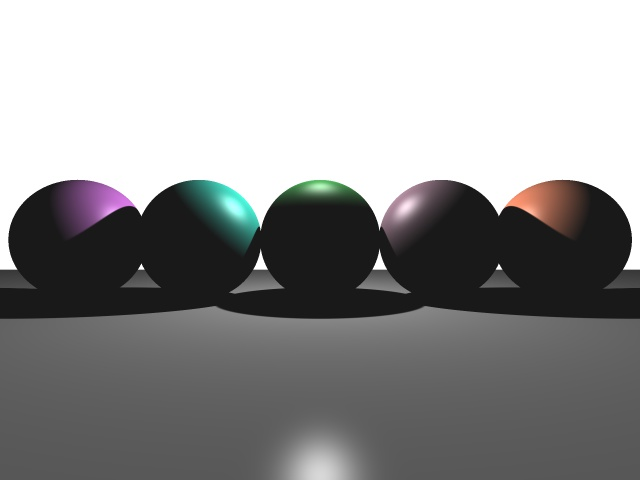

# Improved-Ray-Tracer
## Description
Visual Studio 2019 solution/project files is provided. 

In this Project, I built a ray tracer that runs on GPU using CUDA

## Features
1. Rendered a Double T-shaped Rail.

2. Render the camera at a physically realistic (free falling) speed in a continuous path

3. Randomly generate track from several sequences of splines in track.txt

 

